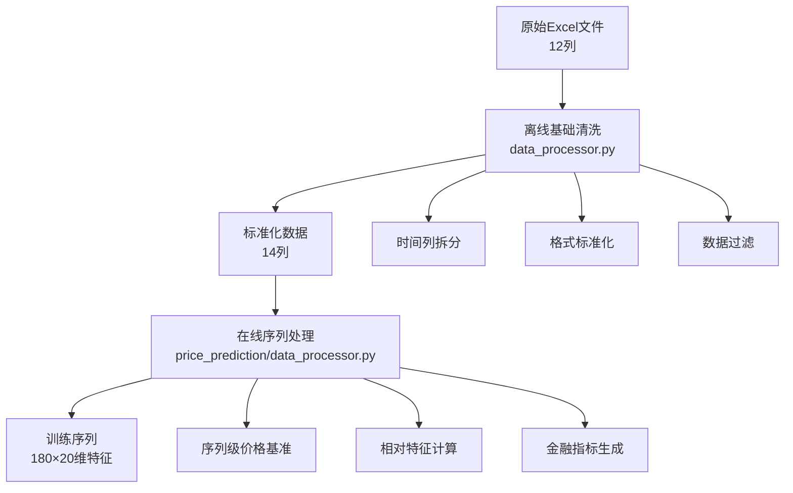

# 金融数据处理完整方案

基于序列级处理的金融数据处理方案，避免数据泄露，确保训练和预测的一致性。

---

##  方案概述

### 核心设计原则

####  避免数据泄露
- **问题**：使用未来数据计算基准会泄露未来信息
- **解决**：每个180天序列独立计算基准
- **优势**：训练和预测使用完全相同的处理逻辑

####  数值尺度统一
- **总手差异**：1,018,000 ~ 123,584,000（差异121倍）
- **金额差异**：200,000,000 ~ 25,000,000,000（差异125倍）
- **价格差异**：茅台1000元 vs 银行股10元
- **解决方案**：序列内相对化处理

###  解决方案架构


---

##  数据结构说明

### 原始数据格式
**数据位置**：`股票数据/行业分类/股票名称.xls`

**原始Excel文件结构**（12列）：
```
时间, 开盘, 最高, 最低, 收盘, 涨幅, 振幅, 总手, 金额, 换手%, 成交次数, Unnamed: 11
```

**数据示例**（茅台原始数据）：
```
2001-08-27,一, 34.51, 37.78, 32.85, 35.39, 2.55, 14.22, 1,410,347,000, 56.83, 927
```

### 处理后数据格式
**基础清洗后结构**（14列）：
```
年, 月, 日, 星期, 开盘, 最高, 最低, 收盘, 涨幅, 振幅, 总手, 金额, 换手%, 成交次数
```

**处理后示例**：
```
2001, 8, 27, 1, 34.51, 37.78, 32.85, 35.39, 2.55, 14.22, 1410347000, 56.83, 927
```

### 最终特征结构
**模型输入特征**（20维）：
```python
# 在 src/price_prediction/data_processor.py 中实现
feature_columns = [
    'month', 'day', 'weekday',                    # 时间特征 (3维)
    'price_median', 'open_rel', 'high_rel',       # 价格基准 + OHLC相对值 (5维)
    'low_rel', 'close_rel',
    'change_pct', 'amplitude',                    # 价格变化 (2维)
    'volume_log', 'volume_rel',                   # 成交量：对数 + 相对值 (2维)
    'amount_log', 'amount_rel',                   # 金额：对数 + 相对值 (2维)
    'turnover_rate', 'trade_count',               # 市场活跃度 (2维)
    'big_order_activity', 'chip_concentration','market_sentiment', 'price_volume_sync'  # 金融特征 (4维)
]

# 预测目标：未来多个时间点的close_rel
prediction_targets = [1, 2, 3, 4, 5, 10, 15, 20, 25, 30]  # 未来第N天
```

---

##  两阶段处理架构

---

##  使用示例

### 阶段1：离线基础清洗（data_processor.py）
```bash
# 运行基础数据清洗
python data_processor.py

# 选择选项1：基础数据处理
# 输入：原始Excel文件（12列）
# 输出：标准化数据（14列）
```
**目标**：将原始数据标准化为统一格式，不进行特征工程

**处理内容**：
1. **文件读取**：多引擎适配不同Excel格式
2. **时间拆分**：`2001-08-27,一` → `年, 月, 日, 星期`
3. **格式标准化**：删除百分号、处理逗号分隔符
4. **数据过滤**：日期过滤、无效数据清理

**输出**：标准化的基础数据（14列）

```python
def offline_basic_cleaning(input_file, output_file):
    """离线基础数据清洗"""
    # 1. 文件读取
    df = read_excel_robust(input_file)

    # 2. 时间列处理
    df = parse_time_columns(df)

    # 3. 格式标准化
    df = clean_data_formats(df)

    # 4. 数据过滤
    df = apply_data_filter(df)

    # 5. 保存标准化数据
    df.to_excel(output_file, index=False)
    return df
```


### 阶段2：在线序列处理（src/price_prediction/data_processor.py）

**目标**：在创建训练序列时进行特征工程，避免数据泄露

**处理内容**：
1. **序列级价格基准**：使用180天序列内的价格中位数
2. **相对价格特征**：OHLC相对于序列基准的比值
3. **成交量特征**：序列内的相对变化和统计特征
4. **金融特征**：基于序列内数据的技术指标

**输出**：训练就绪的特征序列（180×20维）
---

##  序列级特征处理方法

### 1. 序列级价格特征处理

```python
def process_sequence_price_features(sequence_df):
    """
    对180天序列进行价格特征处理
    关键：使用序列内数据计算基准，避免数据泄露
    """
    # 计算序列内所有OHLC的中位数作为基准
    ohlc_data = sequence_df[['开盘', '最高', '最低', '收盘']]
    all_prices = ohlc_data.values.flatten()
    all_prices = all_prices[~pd.isna(all_prices)]
    sequence_price_median = np.median(all_prices)

    # OHLC相对于序列基准的比值
    open_rel = sequence_df['开盘'] / sequence_price_median
    high_rel = sequence_df['最高'] / sequence_price_median
    low_rel = sequence_df['最低'] / sequence_price_median
    close_rel = sequence_df['收盘'] / sequence_price_median

    return {
        'price_median': sequence_price_median,  # 序列价格基准
        'open_rel': open_rel.fillna(1.0),
        'high_rel': high_rel.fillna(1.0),
        'low_rel': low_rel.fillna(1.0),
        'close_rel': close_rel.fillna(1.0)
    }
```

### 2. 序列级成交量/金额处理

```python
def process_sequence_volume_amount(sequence_df, col):
    """
    对180天序列的成交量/金额进行处理
    方法1：序列内中位数基准 + 相对值
    方法2：序列内相对变化率
    """
    values = pd.to_numeric(sequence_df[col], errors='coerce').fillna(0)

    # 方法1：序列内中位数基准
    sequence_median = values.median()
    if sequence_median == 0:
        sequence_median = 1.0
    relative_values = values / sequence_median

    # 方法2：相对变化率（20日滚动均值）
    rolling_mean = values.rolling(window=20, min_periods=1).mean()
    rolling_mean = rolling_mean.fillna(method='bfill').fillna(1.0)
    rolling_mean = rolling_mean.replace(0, 1.0)
    relative_change = (values - rolling_mean) / rolling_mean * 100

    return relative_values, relative_change.fillna(0.0)
```

### 3. 序列级金融特征处理
---

##  Transformer网络的金融特征含义

**本节专注于价格预测网络（Transformer）如何理解金融特征**

| 特征组合 | 隐含信息 | 典型场景 | 在Transformer中的作用 |
|---------|----------|----------|----------------------|
| **总手 / 成交次数** | 平均每笔成交手数 → **大单活跃度** | >500手/笔：机构异动 | **时序注意力**：识别机构进出时点 |
| **换手率 / 总手** | 实际流通盘变化 → **筹码集中度** | 高换手+总手骤增：主力对倒 | **长期模式**：180天内的资金流向 |
| **成交次数 / 换手率** | 散户参与热度 → **市场情绪** | 次数激增+换手率升：散户跟风 | **情绪周期**：识别散户情绪波动 |
| **振幅 / 涨幅** | 价格波动效率 → **市场分歧** | 高振幅低涨幅：多空分歧大 | **价格预测**：预测未来7天波动 |

>  **Transformer优势**：通过180天的长序列，能够捕捉这些关系的时序演变模式！
```python
def process_sequence_financial_features(sequence_df):
    """
    对180天序列计算金融特征
    关键：不进行极值裁剪，保持原始数值分布
    """
    # 特征1：大单活跃度 = 总手 / 成交次数
    big_order_activity = sequence_df['总手'] / (sequence_df['成交次数'] + 1e-6)

    # 特征2：筹码集中度 = 换手率 / 标准化总手
    volume_mean = sequence_df['总手'].rolling(30, min_periods=1).mean()
    volume_normalized = sequence_df['总手'] / (volume_mean + 1e-6)
    chip_concentration = sequence_df['换手%'] / (volume_normalized + 1e-6)

    # 特征3：市场情绪 = 涨幅 * 振幅交互
    market_sentiment = sequence_df['涨幅'] * sequence_df['振幅'] / 100

    # 特征4：价量同步性 = 涨幅方向 * 成交量变化方向
    price_direction = np.sign(sequence_df['涨幅'])
    volume_change = sequence_df['总手'].pct_change().fillna(0)
    volume_direction = np.sign(volume_change)
    price_volume_sync = price_direction * volume_direction

    # 标准化但不裁剪极值
    return {
        'big_order_activity': standardize_without_clipping(big_order_activity),
        'chip_concentration': standardize_without_clipping(chip_concentration),
        'market_sentiment': standardize_without_clipping(market_sentiment),
        'price_volume_sync': price_volume_sync
    }

def standardize_without_clipping(series):
    """标准化但不裁剪极值，保留完整数值分布"""
    mean = series.mean()
    std = series.std() + 1e-6
    return (series - mean) / std
```


##  量纲统一检查
### 处理后各特征的数值范围

```python
# 检查所有18维特征是否统一到合理量纲
def check_feature_ranges(processed_features):
    """
    检查处理后特征的数值范围，确保统一量纲
    """
    feature_names = [
        '月', '日', '星期',                           # 时间特征
        'price_median', 'open_rel', 'high_rel',       # 价格特征
        'low_rel', 'close_rel',
        '涨幅', '振幅',   '换手%',                     # 百分比特征
        'volume_log', 'volume_rel',                   # 成交量特征
        'amount_log', 'amount_rel',                   # 金额特征
        '成交次数',                                     # 市场活跃度
        'big_order_activity', 'chip_concentration',   # 金融特征1,2
        'market_sentiment', 'price_volume_sync'       # 金融特征3,4
    ]

    ranges = {}
    for i, name in enumerate(feature_names):
        col_data = processed_features[:, i]
        ranges[name] = {
            'min': np.min(col_data),
            'max': np.max(col_data),
            'mean': np.mean(col_data),
            'std': np.std(col_data)
        }

    return ranges
```
---

##  数据验证与质量保证

### 验证序列处理结果

```python
def validate_sequence_processing():
    """验证序列处理是否避免了数据泄露"""
    # 检查不同序列的价格基准
    sequence1 = cleaned_data.iloc[0:180]
    sequence2 = cleaned_data.iloc[100:280]

    features1 = process_sequence_features(sequence1)
    features2 = process_sequence_features(sequence2)

    # 不同序列应该有不同的价格基准
    print(f"序列1价格基准: {features1['price_median']}")
    print(f"序列2价格基准: {features2['price_median']}")

    # 检查特征范围（不应该被裁剪）
    print(f"大单活跃度范围: [{features1['big_order_activity'].min():.3f}, {features1['big_order_activity'].max():.3f}]")
```

### 数据质量检查

```python
def check_data_quality(sequences):
    """检查处理后数据的质量"""
    print(f"序列数量: {len(sequences)}")
    print(f"序列形状: {sequences[0].shape}")  # 应该是 (180, 20)

    # 检查是否有NaN值
    has_nan = np.isnan(sequences).any()
    print(f"包含NaN值: {has_nan}")

    # 检查数值范围
    for i, feature_name in enumerate(feature_columns):
        feature_values = sequences[:, :, i].flatten()
        print(f"{feature_name}: [{feature_values.min():.3f}, {feature_values.max():.3f}]")
```

### 预期的数值范围（20维特征）

| 特征组 | 特征名 | 预期范围 | 量纲状态 |
|--------|--------|----------|----------|
| **时间** | 月 | [1, 12] |  统一 |
| | 日 | [1, 31] |  统一 |
| | 星期 | [1, 7] |  统一 |
| **价格** | price_median | [252日滚动中位数] |  需Batch标准化 |
| | OHLC_rel | [0.95, 1.05] |  统一 |
| **价格变化** | 涨幅 | [-10, 10] |  统一 |
| | 振幅 | [0, 20] |  统一 |
| **成交量** | volume_log | [10, 20] |  统一 |
| | volume_rel | [-50, 50] |  统一 |
| **金额** | amount_log | [15, 25] |  统一 |
| | amount_rel | [-50, 50] |  统一 |
| **市场** | 换手% | [0, 50] |  统一 |
| | 成交次数 | [100, 10000] |  需标准化 |
| **金融1** | big_order_activity | [-3, 3] |  统一 |
| **金融2** | chip_concentration | [-3, 3] |  统一 |
| **金融3** | market_sentiment | [-3, 3] |  统一 |
| **金融4** | price_volume_sync | [-1, 1] |  统一 |

### 需要Batch标准化的特征

```python
# 这些特征仍有跨股票差异，需要Batch序列内标准化
batch_norm_needed = [
    'price_median',    # 不同股票价格基准不同
    '成交次数'         # 不同股票成交次数量级不同
]

# 在BatchSequenceNorm中会自动处理这些差异
```

##  方案优势与价值

### 解决的核心问题

1. ** 数据泄露问题**
   - **问题**：传统方法使用未来数据计算基准
   - **解决**：序列级处理，每个180天序列独立计算基准
   - **价值**：确保模型泛化能力，避免过拟合

2. ** 预测一致性问题**
   - **问题**：训练和预测使用不同的处理逻辑
   - **解决**：训练和预测使用完全相同的序列级处理
   - **价值**：确保模型在实际应用中的稳定性

3. ** 数值尺度差异**
   - **问题**：不同股票间价格、成交量差异巨大
   - **解决**：序列内相对化处理，统一量纲
   - **价值**：支持跨股票建模，提高模型通用性

4. ** 特征工程复杂性**
   - **问题**：需要保持金融意义的同时统一量纲
   - **解决**：不裁剪极值，保持原始数值分布
   - **价值**：保留完整的市场信息，提高预测精度

### 技术创新点

- **序列级基准计算**：避免数据泄露的关键技术
- **两阶段处理架构**：离线清洗 + 在线特征工程
- **无极值裁剪**：保持原始数值分布的完整性
- **金融特征工程**：基于金融理论的特征设计
##  最终版序列处理器使用指南

###  快速开始

```python
from sequence_processor import SequenceProcessor, PriceDataset, predict_stock_price

# 1. 创建训练数据集
dataset = PriceDataset("processed_data_2025-07-30/股票数据")
dataloader = DataLoader(dataset, batch_size=32, shuffle=True)

# 2. 训练模型
for inputs, targets in dataloader:
    # inputs: [batch_size, 180, 20]
    # targets: [batch_size, 10] - 未来10个时间点
    outputs = model(inputs)
    loss = criterion(outputs, targets)

# 3. 预测
predictions = predict_stock_price(model, "茅台.xlsx")
# predictions: [10] - 未来第1,2,3,4,5,10,15,20,25,30天的预测值
```

###  核心特性

 **避免数据泄露**：每个180天序列独立计算基准
 **预测一致性**：训练和预测使用相同逻辑
 **20维特征**：完整的金融特征工程
 **10个预测点**：未来第1,2,3,4,5,10,15,20,25,30天
 **无极值裁剪**：保持原始数值分布

###  数据流程

```
原始数据(12列) → 基础清洗(14列) → 序列处理(180×20) → 模型训练 → 预测(10维)
```

---

##  总结

这个最终版金融数据处理方案实现了从原始Excel文件到训练就绪数据的端到端处理：

###  两阶段架构
 **阶段1-离线基础清洗**：时间拆分、格式标准化、智能过滤
 **阶段2-在线序列处理**：序列级特征工程、避免数据泄露

###  关键技术改进
 **序列级基准**：每个180天序列独立计算价格基准
 **无极值裁剪**：保持原始数值分布
 **预测一致性**：训练和预测使用完全相同的处理逻辑
 **数据质量保证**：格式统一、异常处理、边缘情况处理

###  解决的核心问题
1. **数据泄露** → 序列级处理，不使用未来信息
2. **预测不可用** → 训练和预测逻辑完全一致
3. **量级差异** → 序列内相对化处理
4. **信息丢失** → 双重处理保留敏感性，不裁剪极值

这个方案既保持了金融数据的经济学含义，又满足了深度学习模型的技术要求，**最重要的是避免了数据泄露，确保了模型的泛化能力**！


