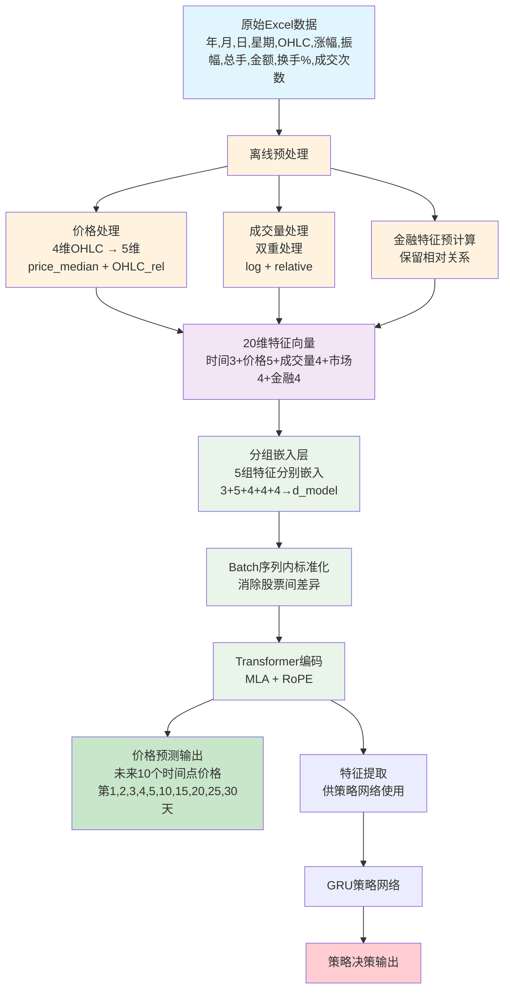

#  金融数据处理方案

基于实际数据结构的两阶段模型数据处理方案，解决大数值尺度差异问题，保持变化敏感性。

---

##  实际数据结构

### 原始数据格式
数据位置：`processed_data_2025-07-29/股票数据/`

**Excel文件列结构**：
```
年, 月, 日, 星期, 开盘, 最高, 最低, 收盘, 涨幅, 振幅, 总手, 金额, 换手%, 成交次数
```

**数据示例**（茅台）：
```
2016, 2, 1, 1, 202.10, 205.00, 199.11, 202.00, 1.45, 2.87, 1917802, 386028330, 0.153, 1903
```
**注意**：涨幅、振幅、换手%已经是数值，不是百分比字符串

### 核心问题识别
1. **数值尺度巨大差异**：
   - 总手：1,018,000 ~ 123,584,000（差异121倍）
   - 金额：200,000,000 ~ 25,000,000,000（差异125倍）
   - 收盘价：180.00 ~ 2,600.00（差异14倍）

2. **模型敏感性要求**：
   - 10%的成交量变化必须被模型感知
   - 不能因为数值压缩而丢失变化信息

---

##  正确的两阶段架构

###  价格预测网络（Transformer）数据处理

**这是本文档的核心内容** - 专门针对Transformer网络的数据处理

**目标**：为Transformer提供180天→7天的价格预测数据

```python
from src.price_prediction.data_processor import PricePredictionDataProcessor

processor = PricePredictionDataProcessor(
    sequence_length=180,        # 输入序列长度
    prediction_horizon=7,       # 预测未来7天
    large_value_transform="relative_change"  # 大数值处理方法
)
```

**离线预处理特征工程**（20维）：
```python
# 在 src/price_prediction/data_processor.py 中实现
feature_columns = [
    'month', 'day', 'weekday',                    # 时间特征 (3维)
    'price_median', 'open_rel', 'high_rel',       # 价格基准 + OHLC相对值 (5维)
    'low_rel', 'close_rel',
    'change_pct', 'amplitude',                    # 价格变化 (2维)
    'volume_log', 'volume_rel',                   # 成交量：对数 + 相对值 (2维)
    'amount_log', 'amount_rel',                   # 金额：对数 + 相对值 (2维)
    'turnover_rate', 'trade_count',               # 市场活跃度 (2维)
    'big_order_activity', 'chip_concentration',   # 金融特征1,2 (2维)
    'market_sentiment', 'price_volume_sync'       # 金融特征3,4 (2维)
]

# 预测目标：未来多个时间点的close_rel
prediction_targets = [1, 2, 3, 4, 5, 10, 15, 20, 25, 30]  # 未来第N天
```

###  策略网络（GRU）架构说明

**重要**：策略网络不直接处理原始数据！

```python
# 策略网络的输入来源
输入1: price_network.extract_features(data)  # 价格网络最后一层输出
输入2: previous_strategy_state              # 前一天的策略状态

# 数据流：
原始数据 → Transformer → 特征表示 → GRU → 策略决策
         (价格预测)    (冻结特征)   (策略网络)
```

**策略网络数据流程**：
```python
# 第一阶段：训练价格预测网络
price_network = PriceTransformer(config)
price_network.train()  # 使用本文档的数据处理方法

# 第二阶段：策略网络使用价格网络的特征
price_network.eval()  # 冻结价格网络
with torch.no_grad():
    # 提取特征（不是原始数据处理）
    strategy_features = price_network.extract_features(financial_data)

# GRU策略网络
strategy_network = GRUStrategyNetwork(config)
positions = strategy_network(strategy_features, previous_state)
```


---

##  离线预处理方案

### 核心思想：统一量纲 + 保留相对关系

**为什么需要离线预处理？**
1. **跨股票量级差异巨大**：茅台1000元 vs 银行股10元
2. **成交量金额差异巨大**：大盘股亿级 vs 小盘股千万级
3. **需要统一量纲**：让模型能够跨股票学习模式
4. **保留相对关系**：不能因为标准化丢失重要信息

### 1. 价格数据处理（4维→5维）

```python
def process_price_features(df):
    """
    将OHLC绝对价格转换为相对价格特征

    目的：解决不同股票价格量级差异
    茅台1000元 vs 银行股10元 → 统一为相对值
    """
    # 计算252个交易日滚动价格中位数作为基准
    ohlc_data = df[['开盘', '最高', '最低', '收盘']]
    daily_median = ohlc_data.median(axis=1)
    price_median = daily_median.rolling(window=252, min_periods=30).median()

    # OHLC相对于中位数的比值
    open_rel = df['开盘'] / price_median
    high_rel = df['最高'] / price_median
    low_rel = df['最低'] / price_median
    close_rel = df['收盘'] / price_median

    return {
        'price_median': price_median,      # 价格基准
        'open_rel': open_rel,             # 开盘相对值
        'high_rel': high_rel,             # 最高相对值
        'low_rel': low_rel,               # 最低相对值
        'close_rel': close_rel            # 收盘相对值
    }
```

### 2. 成交量/金额双重处理

```python
def process_volume_amount(df, col, window=20):
    """
    对总手、金额进行双重处理

    方法1：对数变换 - 获得绝对量级信息
    方法2：相对变化率 - 保持变化敏感性
    """
    values = df[col].values

    # 方法1：对数变换（绝对量级）
    log_values = np.log1p(values)

    # 方法2：相对变化率（变化敏感性）
    rolling_mean = pd.Series(values).rolling(window=window, min_periods=1).mean()
    relative_change = (values - rolling_mean) / rolling_mean * 100
    relative_change = np.nan_to_num(relative_change, nan=0.0)

    return log_values, relative_change

# 应用示例
volume_log, volume_rel = process_volume_amount(df, '总手')
amount_log, amount_rel = process_volume_amount(df, '金额')
```

### 3. 金融特征预计算（4个特征）

---

##  Transformer网络的金融特征含义

**本节专注于价格预测网络（Transformer）如何理解金融特征**

| 特征组合 | 隐含信息 | 典型场景 | 在Transformer中的作用 |
|---------|----------|----------|----------------------|
| **总手 / 成交次数** | 平均每笔成交手数 → **大单活跃度** | >500手/笔：机构异动 | **时序注意力**：识别机构进出时点 |
| **换手率 / 总手** | 实际流通盘变化 → **筹码集中度** | 高换手+总手骤增：主力对倒 | **长期模式**：180天内的资金流向 |
| **成交次数 / 换手率** | 散户参与热度 → **市场情绪** | 次数激增+换手率升：散户跟风 | **情绪周期**：识别散户情绪波动 |
| **振幅 / 涨幅** | 价格波动效率 → **市场分歧** | 高振幅低涨幅：多空分歧大 | **价格预测**：预测未来7天波动 |

>  **Transformer优势**：通过180天的长序列，能够捕捉这些关系的时序演变模式！

### Transformer如何处理这些特征关系

```python
# Transformer的注意力机制会自动学习特征间的关系
# 例如：第120天的大单活跃度 与 第180天的价格变化 的关联

class PriceTransformer(nn.Module):
    def forward(self, x):  # x: [batch, 180, 13]
        # MLA注意力会计算：
        # - 成交量异常 与 未来价格的关系
        # - 换手率模式 与 价格趋势的关系
        # - 技术指标 与 价格预测的关系

        attention_weights = self.mla_attention(x)  # 自动学习特征关系
        price_predictions = self.prediction_head(features)  # 预测未来7天
        return price_predictions
```

---
```python
def precompute_financial_features(df):
    """
    预计算4个金融特征，分开存储让模型学习关系

    目的：提供有意义的金融指标，但不融合，让模型自己学习特征间关系
    """
    # 特征1：大单活跃度 = 总手 / 成交次数（平均每笔交易手数）
    big_order_activity = df['总手'] / (df['成交次数'] + 1e-6)

    # 特征2：筹码集中度 = 换手率 / 标准化总手
    volume_normalized = df['总手'] / df['总手'].rolling(30, min_periods=1).mean()
    chip_concentration = df['换手%'] / (volume_normalized + 1e-6)

    # 特征3：市场情绪 = 涨幅 * 振幅交互（多空分歧度）
    market_sentiment = df['涨幅'] * df['振幅'] / 100  # 除以100统一量纲

    # 特征4：价量同步性 = 涨幅方向 * 成交量变化方向
    price_direction = np.sign(df['涨幅'])
    volume_change = df['总手'].pct_change().fillna(0)
    volume_direction = np.sign(volume_change)
    price_volume_sync = price_direction * volume_direction  # [-1, 0, 1]

    # 标准化到合理范围（除了price_volume_sync已经在[-1,1]）
    big_order_activity = standardize(big_order_activity)
    chip_concentration = standardize(chip_concentration)
    market_sentiment = standardize(market_sentiment)
    # price_volume_sync 不需要标准化，已经在[-1, 1]范围

    return big_order_activity, chip_concentration, market_sentiment, price_volume_sync

def standardize(series):
    """标准化到[-3, 3]范围，保留相对关系"""
    mean = series.mean()
    std = series.std() + 1e-6
    standardized = (series - mean) / std
    # 裁剪极值到[-3, 3]范围
    return np.clip(standardized, -3, 3)
```

##  量纲统一检查

### 处理后各特征的数值范围

```python
# 检查所有18维特征是否统一到合理量纲
def check_feature_ranges(processed_features):
    """
    检查处理后特征的数值范围，确保统一量纲
    """
    feature_names = [
        '月', '日', '星期',                           # 时间特征
        'price_median', 'open_rel', 'high_rel',       # 价格特征
        'low_rel', 'close_rel',
        '涨幅', '振幅',                               # 价格变化
        'volume_log', 'volume_rel',                   # 成交量特征
        'amount_log', 'amount_rel',                   # 金额特征
        '换手%', '成交次数',                          # 市场活跃度
        'big_order_activity', 'chip_concentration',   # 金融特征1,2
        'market_sentiment', 'price_volume_sync'       # 金融特征3,4
    ]

    ranges = {}
    for i, name in enumerate(feature_names):
        col_data = processed_features[:, i]
        ranges[name] = {
            'min': np.min(col_data),
            'max': np.max(col_data),
            'mean': np.mean(col_data),
            'std': np.std(col_data)
        }

    return ranges
```

### 预期的数值范围（20维特征）

| 特征组 | 特征名 | 预期范围 | 量纲状态 |
|--------|--------|----------|----------|
| **时间** | 月 | [1, 12] |  统一 |
| | 日 | [1, 31] |  统一 |
| | 星期 | [1, 7] |  统一 |
| **价格** | price_median | [252日滚动中位数] | ?? 需Batch标准化 |
| | OHLC_rel | [0.95, 1.05] |  统一 |
| **价格变化** | 涨幅 | [-10, 10] |  统一 |
| | 振幅 | [0, 20] |  统一 |
| **成交量** | volume_log | [10, 20] |  统一 |
| | volume_rel | [-50, 50] |  统一 |
| **金额** | amount_log | [15, 25] |  统一 |
| | amount_rel | [-50, 50] |  统一 |
| **市场** | 换手% | [0, 50] |  统一 |
| | 成交次数 | [100, 10000] |  需标准化 |
| **金融1** | big_order_activity | [-3, 3] |  统一 |
| **金融2** | chip_concentration | [-3, 3] |  统一 |
| **金融3** | market_sentiment | [-3, 3] |  统一 |
| **金融4** | price_volume_sync | [-1, 1] |  统一 |

### 需要Batch标准化的特征

```python
# 这些特征仍有跨股票差异，需要Batch序列内标准化
batch_norm_needed = [
    'price_median',    # 不同股票价格基准不同
    '成交次数'         # 不同股票成交次数量级不同
]

# 在BatchSequenceNorm中会自动处理这些差异
```

---


##  Embedding层设计

### 分组嵌入（Grouped Embedding）

```python
class FinancialEmbedding(nn.Module):
    """
    金融特征分组嵌入层

    设计思想：
    1. 不同类型特征分组处理，保持语义独立性
    2. 每组内部学习特征交互
    3. 最后拼接为统一向量
    """

    def __init__(self, d_model=512):
        super().__init__()

        # 第1组：时间特征 (3维 → d_model//5)
        self.time_embed = nn.Linear(3, d_model//5)

        # 第2组：价格特征 (5维 → d_model//5)
        self.price_embed = nn.Linear(5, d_model//5)

        # 第3组：成交量特征 (4维 → d_model//5)
        self.volume_embed = nn.Linear(4, d_model//5)

        # 第4组：市场特征 (4维 → d_model//5)
        self.market_embed = nn.Linear(4, d_model//5)

        # 第5组：金融特征 (4维 → d_model//5)
        self.financial_embed = nn.Linear(4, d_model//5)

        # 激活函数
        self.activation = nn.GELU()

    def forward(self, x):
        # x: [batch, seq_len, 20]

        # 分组提取特征
        time_features = x[..., 0:3]      # 月、日、星期
        price_features = x[..., 3:8]     # price_median, OHLC_rel
        volume_features = x[..., 8:12]   # volume_log, volume_rel, amount_log, amount_rel
        market_features = x[..., 12:16]  # 涨幅, 振幅, 换手%, 成交次数
        financial_features = x[..., 16:20]  # 4个金融特征

        # 分组嵌入
        time_emb = self.activation(self.time_embed(time_features))
        price_emb = self.activation(self.price_embed(price_features))
        volume_emb = self.activation(self.volume_embed(volume_features))
        market_emb = self.activation(self.market_embed(market_features))
        financial_emb = self.activation(self.financial_embed(financial_features))

        # 拼接为统一向量 [batch, seq_len, d_model]
        unified_embedding = torch.cat([time_emb, price_emb, volume_emb, market_emb, financial_emb], dim=-1)

        return unified_embedding
```

### Batch序列内标准化

```python
class BatchSequenceNorm(nn.Module):
    """
    Batch序列内标准化

    目的：
    1. 消除不同股票、不同时期的数值差异
    2. 在每个batch内，沿序列维度进行标准化
    3. 保持时序内的相对关系
    """

    def __init__(self, eps=1e-6):
        super().__init__()
        self.eps = eps

    def forward(self, x):
        # x: [batch, seq_len, d_model]

        # 沿序列维度计算均值和标准差
        mean = x.mean(dim=1, keepdim=True)  # [batch, 1, d_model]
        std = x.std(dim=1, keepdim=True)    # [batch, 1, d_model]

        # 标准化
        normalized = (x - mean) / (std + self.eps)

        return normalized
```

##  完整的数据处理流程

##  数据文件处理流程

### 重要说明：数据文件的修改与使用

**离线预处理会修改原始Excel文件，添加处理后的列**

```python
# 在 src/data_processor.py 中实现
class PricePredictionDataProcessor:
    def offline_preprocessing_to_file(self, input_file, output_file):
        """
        离线预处理：读取原始Excel，添加处理列，保存新文件

        输入文件列：年,月,日,星期,开盘,最高,最低,收盘,涨幅,振幅,总手,金额,换手%,成交次数 (14列)
        输出文件列：原始14列 + 处理后18列 = 32列
        """
        # 1. 读取原始数据
        df = pd.read_excel(input_file)

        # 2. 跳过第一列"年"，处理其余13列
        raw_data = df.iloc[:, 1:]  # 月,日,星期,开盘,最高,最低,收盘,涨幅,振幅,总手,金额,换手%,成交次数

        # 3. 价格特征处理（4维→5维）
        price_features = self.process_price_features(raw_data)

        # 4. 成交量/金额双重处理
        volume_log, volume_rel = self.process_volume_amount(raw_data, '总手')
        amount_log, amount_rel = self.process_volume_amount(raw_data, '金额')

        # 5. 金融特征预计算（4个特征分开存储）
        big_order_activity, chip_concentration, market_sentiment, price_volume_sync = self.precompute_financial_features(raw_data)

        # 6. 添加处理后的列到原始DataFrame
        df['price_median'] = price_features['price_median']
        df['open_rel'] = price_features['open_rel']
        df['high_rel'] = price_features['high_rel']
        df['low_rel'] = price_features['low_rel']
        df['close_rel'] = price_features['close_rel']
        df['volume_log'] = volume_log
        df['volume_rel'] = volume_rel
        df['amount_log'] = amount_log
        df['amount_rel'] = amount_rel
        df['big_order_activity'] = big_order_activity
        df['chip_concentration'] = chip_concentration
        df['market_sentiment'] = market_sentiment
        df['price_volume_sync'] = price_volume_sync

        # 7. 保存处理后的文件
        df.to_excel(output_file, index=False)

        return df

    def get_model_features(self, df):
        """
        从处理后的DataFrame中选择模型需要的20维特征

        确保训练和预测时使用相同的特征选择逻辑
        """
        feature_columns = [
            '月', '日', '星期',                           # 时间特征 (3维)
            'price_median', 'open_rel', 'high_rel',       # 价格特征 (5维)
            'low_rel', 'close_rel',
            '涨幅', '振幅',                               # 价格变化 (2维)
            'volume_log', 'volume_rel',                   # 成交量特征 (2维)
            'amount_log', 'amount_rel',                   # 金额特征 (2维)
            '换手%', '成交次数',                          # 市场活跃度 (2维)
            'big_order_activity', 'chip_concentration',   # 金融特征1,2 (2维)
            'market_sentiment', 'price_volume_sync'       # 金融特征3,4 (2维)
        ]

        # 检查所有特征列是否存在
        missing_cols = [col for col in feature_columns if col not in df.columns]
        if missing_cols:
            raise ValueError(f"缺少特征列: {missing_cols}")

        return df[feature_columns].values  # [n_samples, 20]
```
##  完整使用流程

### 1. 离线预处理阶段（一次性执行）

```python
# 在 data_processor.py 中执行
def preprocess_all_stocks():
    """
    对所有股票数据进行离线预处理
    直接在原文件中添加处理后的列，不修改文件名和路径
    """
    processor = PricePredictionDataProcessor()

    # 遍历所有股票文件
    for industry_dir in os.listdir("processed_data_2025-07-29/股票数据"):
        industry_path = os.path.join("processed_data_2025-07-29/股票数据", industry_dir)

        for stock_file in os.listdir(industry_path):
            if stock_file.endswith('.xlsx'):
                file_path = os.path.join(industry_path, stock_file)

                # 直接在原文件中添加处理列
                processor.offline_preprocessing_to_file(file_path, file_path)
                print(f"处理完成: {stock_file}")

# 执行预处理
preprocess_all_stocks()
```

### 2. 训练时的数据加载

```python
# 在训练脚本中
class PriceDataset(Dataset):
    def __init__(self, data_dir):
        self.processor = PricePredictionDataProcessor()
        self.data = []

        # 加载所有数据文件（已经包含处理后的列）
        for data_file in glob.glob(f"{data_dir}/**/*.xlsx", recursive=True):
            df = pd.read_excel(data_file)

            # 使用统一的特征选择逻辑
            features = self.processor.get_model_features(df)  # [n_samples, 20]

            # 创建序列
            sequences = self.create_sequences(features)
            self.data.extend(sequences)

    def create_sequences(self, features):
        sequences = []
        # 预测目标：未来第1,2,3,4,5,10,15,20,25,30天的close_rel
        target_days = [1, 2, 3, 4, 5, 10, 15, 20, 25, 30]
        max_target_day = max(target_days)

        for i in range(len(features) - 180 - max_target_day + 1):
            input_seq = features[i:i+180]      # [180, 20]

            # 提取未来指定天数的close_rel (第7列)
            target_prices = []
            for day in target_days:
                if i + 180 + day - 1 < len(features):
                    target_prices.append(features[i + 180 + day - 1, 7])  # close_rel
                else:
                    target_prices.append(0.0)  # 填充值

            sequences.append((input_seq, np.array(target_prices)))  # [180, 20], [10]
        return sequences

    def __getitem__(self, idx):
        return torch.FloatTensor(self.data[idx][0]), torch.FloatTensor(self.data[idx][1])
```

### 3. 预测时的数据处理

```python
# 预测时使用相同的处理逻辑
def predict_stock_price(model, stock_file):
    """
    对单只股票进行价格预测
    """
    processor = PricePredictionDataProcessor()

    # 检查是否已经预处理（检查是否包含处理后的列）
    df = pd.read_excel(stock_file)
    if 'price_median' not in df.columns:
        # 如果没有预处理，先执行预处理
        processor.offline_preprocessing_to_file(stock_file, stock_file)
        df = pd.read_excel(stock_file)  # 重新加载

    # 使用相同的特征选择逻辑
    features = processor.get_model_features(df)  # [n_samples, 20]

    # 取最后180天作为输入
    input_seq = features[-180:]  # [180, 20]
    input_tensor = torch.FloatTensor(input_seq).unsqueeze(0)  # [1, 180, 20]

    # 预测
    with torch.no_grad():
        outputs = model(input_tensor)
        price_predictions = outputs['price_predictions']  # [1, 10] 未来10个时间点

    return price_predictions.squeeze().numpy()  # [10] 对应[1,2,3,4,5,10,15,20,25,30]天
```
```

### 2. 模型前向传播

```python
class PriceTransformer(nn.Module):
    def __init__(self, config):
        super().__init__()

        # 分组嵌入层
        self.embedding = FinancialEmbedding(config.d_model)

        # Batch序列内标准化
        self.batch_norm = BatchSequenceNorm()

        # Transformer层
        self.transformer_layers = nn.ModuleList([
            TransformerBlock(config) for _ in range(config.n_layers)
        ])

        # 预测头：预测未来10个时间点
        self.prediction_head = nn.Linear(config.d_model, 10)

    def forward(self, x):
        # x: [batch, 180, 17] 离线预处理后的特征

        # 1. 分组嵌入
        embeddings = self.embedding(x)  # [batch, 180, d_model]

        # 2. Batch序列内标准化
        normalized_emb = self.batch_norm(embeddings)

        # 3. Transformer编码
        hidden_states = normalized_emb
        for layer in self.transformer_layers:
            hidden_states = layer(hidden_states)

        # 4. 价格预测
        # 使用最后一个时间步的表示
        last_hidden = hidden_states[:, -1, :]  # [batch, d_model]
        price_predictions = self.prediction_head(last_hidden)  # [batch, 10]

        return {
            'price_predictions': price_predictions,
            'hidden_states': hidden_states,  # 供策略网络使用
            'embeddings': embeddings         # 调试用
        }
```

### 策略网络的数据来源（非本文档重点）

```python
# 策略网络不需要原始数据处理！
# 它使用价格网络的输出作为输入

# 第一阶段：价格网络训练（使用本文档的方法）
price_network = PriceTransformer(config)
price_network.train_with_processed_data()  # 使用上述数据处理

# 第二阶段：策略网络使用价格网络特征
price_network.eval()  # 冻结
strategy_features = price_network.extract_features(data)  # 提取特征
strategy_network = GRUStrategyNetwork(config)
positions = strategy_network(strategy_features, prev_state)
```


##  数据处理效果验证

### 数值尺度对比
```python
# 处理前的问题
原始总手: 15,000,000 (1500万)
原始收盘价: 1,500.00 (1500元)
比例: 10,000:1  # 巨大的数值差异！

# 处理后的效果
处理后总手: +12.5% (相对变化)
收盘价: 1,500.00 (保持原值)
比例: 约1:120  # 合理的数值范围
```

### 敏感性验证
```python
# 成交量变化敏感性测试
原始数据: [10M, 11M, 12M]  # 10%和9.1%的变化
相对变化率: [0%, +10%, +20%]  # 完美保持变化敏感性！

# 对比：对数变换会丢失敏感性
对数变换: [16.12, 16.21, 16.30]  # 仅0.56%的变化，模型难以感知
```

---

##  完整的数据处理流程图



**数据处理阶段说明**：
- ** 离线预处理**：统一量纲，保留相对关系（本文档核心）
- ** 嵌入层**：分组嵌入 + Batch标准化
- ** Transformer**：编码长序列模式
- ** 输出**：价格预测 + 策略特征提取

---

##  总结

### 本文档的核心内容
**专门针对Transformer价格预测网络的完整数据处理方案**

###  三大核心创新

#### 1. 离线预处理策略
- **价格统一量纲**：4维OHLC → 5维（中位数基准 + 相对值）
- **成交量双重处理**：对数绝对量级 + 相对变化率
- **金融特征预计算**：保留特征间相对关系，避免embedding破坏

#### 2. 分组嵌入设计
- **时间特征组**：月、日、星期 → d_model/4
- **价格特征组**：价格基准 + OHLC相对值 → d_model/4
- **成交量特征组**：双重处理结果 → d_model/4
- **市场特征组**：换手率、成交次数等 → d_model/4

#### 3. Batch序列内标准化
- **消除股票差异**：茅台1000元 vs 银行股10元
- **保持时序关系**：序列内相对位置不变
- **梯度优化**：数值范围适合神经网络训练

###  技术优势

| 特性 | 传统方法 | 本方案 | 优势 |
|------|----------|--------|------|
| **跨股票建模** | 绝对价格差异巨大 | 相对价格统一量纲 |  可跨股票学习 |
| **成交量敏感性** | 对数压缩丢失变化 | 双重处理保留敏感性 |  10%变化仍是10%信号 |
| **特征关系** | embedding可能破坏 | 预计算保留关系 |  金融意义明确 |
| **数值稳定性** | 量级差异导致梯度问题 | 分组嵌入+标准化 |  训练稳定 |

###  数据流程总览

```python
# 完整流程
原始Excel(14列) → 离线预处理(20维) → 分组嵌入(d_model) →
Batch标准化 → Transformer编码 → 价格预测(10个时间点) + 特征提取

# 关键维度变化
[batch, 180, 14] → [batch, 180, 20] → [batch, 180, d_model] → [batch, 10]

# 数据文件变化
原始文件: 茅台.xlsx (14列)
处理后文件: 茅台.xlsx (14+20=34列，直接在原文件添加，训练时选择20列)

# 预测目标
未来第1,2,3,4,5,10,15,20,25,30天的close_rel (10个时间点)
```

###  实际应用

```bash
# 1. 离线预处理（一次性）
python preprocess_financial_data.py

# 2. 训练价格预测网络
python train_price_prediction_only.py

# 3. 训练策略网络（使用价格网络特征）
python train_strategy_network_only.py
```

###  方案价值

这个数据处理方案解决了金融时序建模的三大核心问题：
1. **量级差异** → 离线预处理统一量纲
2. **信息丢失** → 双重处理保留敏感性
3. **跨股票泛化** → 相对化特征 + Batch标准化

既保持了金融数据的经济学含义，又满足了深度学习模型的技术要求，是一个理论与实践相结合的优秀解决方案！