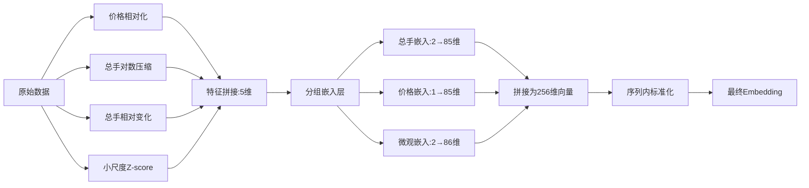

股票每日数据，涨跌幅、振幅、总手、换手率、成交次数，存在较大量级差距，所以需要进行预处理
---

### **Step 1: 原始数据准备**
假设原始数据包含以下字段：
- `price`: 当日价格
- `turnover`: 换手率（单位：%）
- `pct_change`: 涨跌幅（单位：%）
- `volume`: 总手
---

### **Step 2: 全局预处理（离线计算）**
#### **2.1 个股价格相对化**
- 计算每只股票的180日滚动价格中位数作为基准：
  ```python
  df['price_baseline'] = df['price'].transform(
      lambda x: x.rolling(180, min_periods=30).median()
  )
  ```
- 生成相对价格：
  ```python
  df['rel_price'] = df['price'] / df['price_baseline']
  ```

#### **2.2 总手（成交量）处理**
- **绝对量级（对数压缩）**：
  ```python
  df['log_vol'] = np.log1p(df['volume'])
  ```
- **相对变化率**：
  ```python
  df['vol_30d_median'] = df.groupby('stock_id')['volume'].transform(
      lambda x: x.rolling(30).median()
  )
  df['vol_ratio'] = df['volume'] / df['vol_30d_median']
  ```


---

### **Step 3: 模型输入特征组装**
生成最终输入特征向量，顺序如下：
```python
input_features = [
    df['rel_price'],        # 位置0: 个股相对价格
    df['turnover_norm'],    # 位置1: 换手率
    df['pct_change_norm']   # 位置2: 涨跌幅
    df['log_vol'],          # 位置3: 总手绝对量级（对数压缩）
    df['vol_ratio'],        # 位置4: 总手相对变化率
]
input_tensor = torch.tensor(np.column_stack(input_features), dtype=torch.float32)  # [n_samples, 5]
```

---

### **Step 4: 模型嵌入层处理**
#### **4.1 分组嵌入（Grouped Embedding）**
```python
class FinancialEmbedding(nn.Module):
    def __init__(self, hidden_size):
        super().__init__()
        # 第一组：总手特征（绝对量级 + 相对变化）
        self.vol_embed = nn.Linear(2, hidden_size//3)
        
        # 第二组：价格特征
        self.price_embed = nn.Linear(1, hidden_size//3)
        
        # 第三组：微观特征（换手率 + 涨跌幅）
        self.micro_embed = nn.Linear(2, hidden_size//3)
        
    def forward(self, x):
        # x: [batch, seq, 5]
        vol_emb = self.vol_embed(x[..., 0:2])    # 处理log_vol和vol_ratio
        price_emb = self.price_embed(x[..., 2:3]) # 处理rel_price
        micro_emb = self.micro_embed(x[..., 3:5]) # 处理turnover和pct_change
        
        # 拼接为统一向量 [batch, seq, hidden_size]
        return torch.cat([vol_emb, price_emb, micro_emb], dim=-1)
```

#### **4.2 Batch序列内标准化**
```python
class SeqAwareNorm(nn.Module):
    def forward(self, x):
        # x: [batch, seq, features]
        mean = x.mean(dim=1, keepdim=True)  # 沿序列维度计算均值
        std = x.std(dim=1, keepdim=True)
        return (x - mean) / (std + 1e-6)
```

#### **4.3 完整Embedding流程**
```python
# 初始化
embedding_layer = FinancialEmbedding(hidden_size=256)
seq_norm = SeqAwareNorm()

# 前向传播
def embed_features(input_tensor):
    # input_tensor: [batch, seq, 5]
    embeddings = embedding_layer(input_tensor)  # [batch, seq, 256]
    normalized_emb = seq_norm(embeddings)      # 序列内标准化
    return normalized_emb
```

---

### **Step 5: 输出结果**
最终Embedding输出为一个**统一的高维向量**，维度为 `[batch_size, sequence_length, hidden_size]`（如 `[32, 30, 256]`），其特性如下：
1. **总手信息保留完整**：
   - 绝对量级通过 `log_vol` 压缩但保留趋势
   - 突增信号通过 `vol_ratio` 直接体现
2. **小尺度特征不受压制**：
   - 换手率和涨跌幅的原始分布完全保留（仅平移缩放）
   - 极端值（如涨跌停±10%）仍能有效传递
3. **跨股票可比性**：
   - 价格和成交量均已个股相对化
   - Batch序列标准化适应不同波动模式

---

### **关键设计图解**


### **总结**
此方案通过：
1. **特征工程**：构造物理意义明确的输入特征
2. **分组嵌入**：保持不同特征组的独立性
3. **序列标准化**：解决跨股票和时序波动问题
4. **统一向量输出**：满足Transformer的输入要求

在保留所有关键金融信号的同时，确保了模型的训练稳定性和泛化能力。